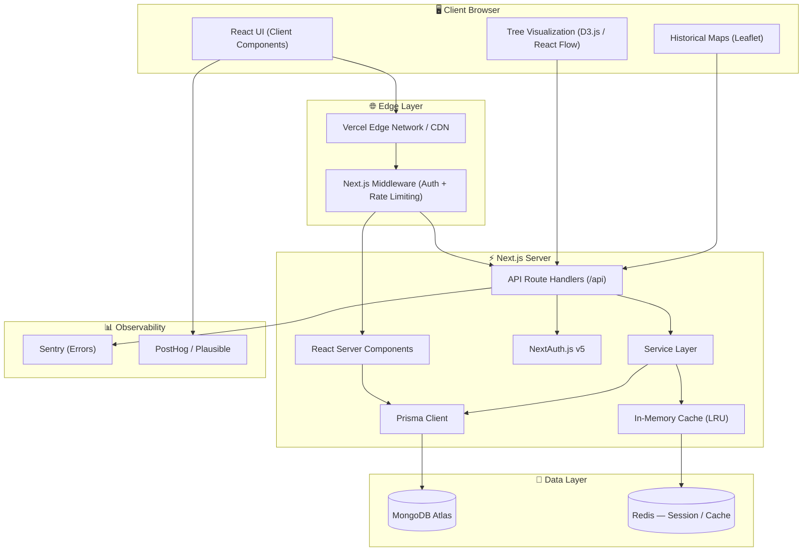
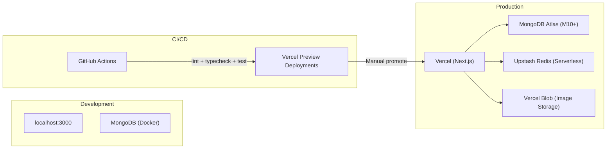
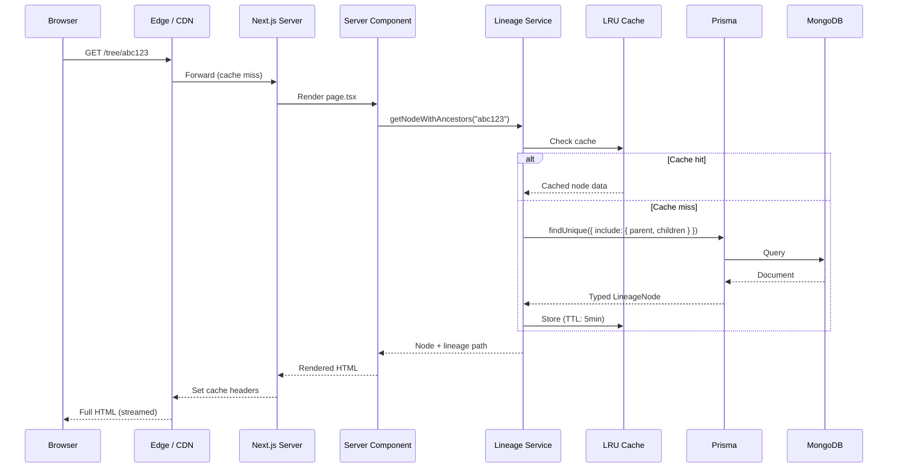
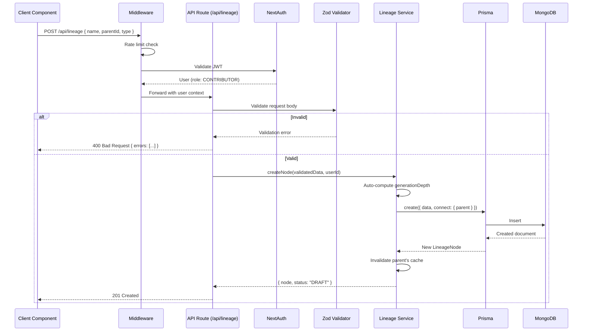
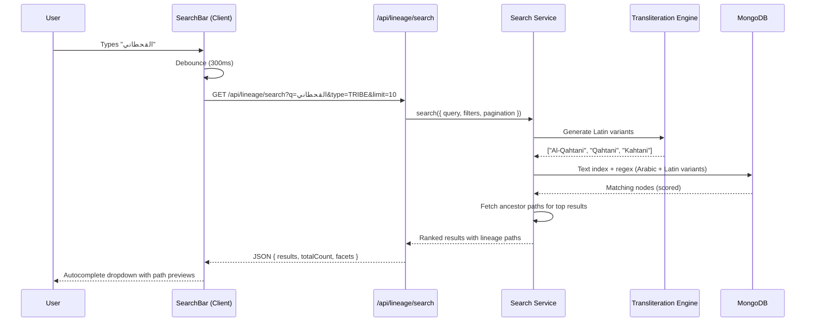
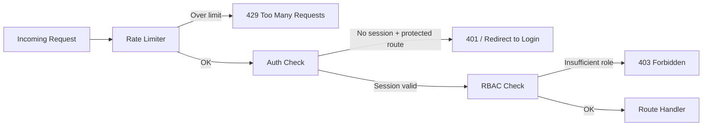

# 🏛️ Technical Architecture

**Project:** ArabTree
**Version:** 1.0
**Last Updated:** 2026-02-12

---

## Table of Contents

1. [System Overview](#1-system-overview)
2. [Deployment Topology](#2-deployment-topology)
3. [Server Components vs. Client Components](#3-server-components-vs-client-components)
4. [Directory Structure](#4-directory-structure)
5. [Data Flow](#5-data-flow)
6. [API Design Conventions](#6-api-design-conventions)
7. [Error Handling Strategy](#7-error-handling-strategy)
8. [Caching Strategy](#8-caching-strategy)
9. [Security Architecture](#9-security-architecture)
10. [Performance Strategy](#10-performance-strategy)
11. [Observability & Monitoring](#11-observability--monitoring)
12. [Key Technical Decisions](#12-key-technical-decisions)

---

## 1. System Overview

ArabTree is built on **Next.js App Router** with a clear separation between Server Components (data fetching, layout) and Client Components (interactivity, visualization). The architecture prioritizes:

- **Performance** — Server-side rendering for initial loads; client-side for interactive trees.
- **Scalability** — Modular feature-based structure; horizontally scalable API.
- **Security** — RBAC at both API and UI layers; NextAuth.js v5 for authentication.
- **Maintainability** — Feature-first code organization; thin API routes delegating to services.



---

## 2. Deployment Topology



| Environment | Infrastructure | Database | Purpose |
|---|---|---|---|
| **Local** | `localhost:3000` | MongoDB via Docker | Development & debugging |
| **Preview** | Vercel Preview Deployment | MongoDB Atlas (dev cluster) | PR reviews & QA |
| **Production** | Vercel (serverless) | MongoDB Atlas (M10+ dedicated) | Live users |

### Infrastructure Choices

| Decision | Rationale |
|---|---|
| **Vercel** | Native Next.js host; automatic edge distribution, preview deployments, serverless scaling |
| **MongoDB Atlas** | Managed MongoDB; auto-scaling, backups, global clusters for latency |
| **Upstash Redis** | Serverless Redis; per-request pricing fits serverless Next.js model |
| **Vercel Blob** | Native file storage for tribal symbol images and user avatars |

---

## 3. Server Components vs. Client Components

Next.js App Router enables a hybrid rendering strategy. Here is how ArabTree leverages it:

### Server Components (Default)

Used for **data-heavy, non-interactive** parts of the UI:

| Component | Rationale |
|---|---|
| Page layouts (`layout.tsx`) | Static structure, no interactivity needed |
| Lineage node detail pages | SEO-critical; data fetched at request time |
| Search results page | Initial render with server-fetched results |
| User profile pages | Mostly read-only data display |
| Admin dashboards | Data tables rendered server-side |

**Benefits:** Zero client JS bundle for these components, faster TTFB, SEO-friendly.

### Client Components (`"use client"`)

Used for **interactive, stateful** parts of the UI:

| Component | Rationale |
|---|---|
| `TreeVisualization` | D3.js / React Flow requires DOM access, zoom/pan handlers |
| `SearchBar` | Real-time autocomplete with debounced API calls |
| `ContributionForm` | Multi-step form with client-side validation |
| `MapExplorer` | Leaflet map with markers and timeline slider |
| `NodeEditor` | Rich text editing for lineage notes |
| `ThemeToggle` | Client-side theme switching |

**Boundary Strategy:** Client components are wrapped in `<Suspense>` with server-rendered fallbacks to prevent layout shift.

```
// Example: Tree page rendering boundary
app/tree/[nodeId]/page.tsx          ← Server Component (fetches node data via service)
  ├── components/AncestorBreadcrumb  ← Server Component (static breadcrumb)
  ├── components/TreeVisualization   ← Client Component (renders D3 tree)
  ├── components/NodeDetailPanel     ← Server Component (node metadata)
  └── components/NodeActions         ← Client Component (edit/verify buttons)
```

---

## 4. Directory Structure

```
arabtree/
├── prisma/
│   ├── schema.prisma                # Database schema
│   └── seed.ts                      # Seed data (Adnan & Qahtan trees)
│
├── src/
│   ├── app/                          # Next.js App Router
│   │   ├── (auth)/                   # Auth route group (no main nav)
│   │   │   ├── login/page.tsx
│   │   │   ├── register/page.tsx
│   │   │   └── layout.tsx            # Auth-specific layout
│   │   ├── (main)/                   # Main app route group
│   │   │   ├── layout.tsx            # Main layout with nav, footer
│   │   │   ├── page.tsx              # Home / landing page
│   │   │   ├── tree/
│   │   │   │   ├── page.tsx          # Tree explorer root (starts at Adnan/Qahtan)
│   │   │   │   └── [nodeId]/
│   │   │   │       └── page.tsx      # Individual node view + subtree
│   │   │   ├── search/page.tsx       # Search results
│   │   │   ├── map/page.tsx          # Historical maps
│   │   │   ├── contribute/page.tsx   # Contribution submission form
│   │   │   ├── profile/page.tsx      # User profile + contribution history
│   │   │   └── admin/                # Admin pages
│   │   │       ├── layout.tsx        # Admin layout with sidebar
│   │   │       ├── users/page.tsx
│   │   │       ├── contributions/page.tsx
│   │   │       └── analytics/page.tsx
│   │   ├── api/                      # API route handlers
│   │   │   ├── auth/[...nextauth]/route.ts
│   │   │   ├── lineage/
│   │   │   │   ├── route.ts          # GET (list) / POST (create)
│   │   │   │   ├── [nodeId]/
│   │   │   │   │   ├── route.ts      # GET / PUT / DELETE
│   │   │   │   │   ├── ancestors/route.ts  # GET ancestor path
│   │   │   │   │   └── subtree/route.ts    # GET subtree (depth param)
│   │   │   │   └── search/route.ts   # GET search with query params
│   │   │   ├── contributions/
│   │   │   │   ├── route.ts          # GET (list) / POST (create)
│   │   │   │   └── [id]/
│   │   │   │       ├── route.ts      # GET / PUT
│   │   │   │       └── review/route.ts  # POST (approve/reject)
│   │   │   └── admin/
│   │   │       ├── users/route.ts
│   │   │       └── stats/route.ts
│   │   ├── layout.tsx                # Root layout (providers, fonts, theme)
│   │   ├── error.tsx                 # Global error boundary
│   │   ├── not-found.tsx             # 404 page
│   │   └── loading.tsx               # Global loading state
│   │
│   ├── features/                     # Feature modules (domain-driven)
│   │   ├── lineage/
│   │   │   ├── components/
│   │   │   │   ├── TreeVisualization.tsx
│   │   │   │   ├── NodeCard.tsx
│   │   │   │   ├── LineagePath.tsx
│   │   │   │   └── AncestorBreadcrumb.tsx
│   │   │   ├── hooks/
│   │   │   │   ├── useTreeNavigation.ts
│   │   │   │   ├── useTreeZoom.ts
│   │   │   │   └── useNodeData.ts
│   │   │   ├── services/
│   │   │   │   ├── lineage.service.ts     # CRUD + tree traversal
│   │   │   │   └── lineage.validation.ts  # Zod schemas
│   │   │   └── types/
│   │   │       └── lineage.types.ts
│   │   ├── search/
│   │   │   ├── components/
│   │   │   │   ├── SearchBar.tsx
│   │   │   │   ├── SearchResults.tsx
│   │   │   │   └── SearchFilters.tsx
│   │   │   ├── hooks/
│   │   │   │   └── useSearch.ts
│   │   │   └── services/
│   │   │       ├── search.service.ts
│   │   │       └── transliteration.ts     # Arabic ↔ Latin mappings
│   │   ├── map/
│   │   │   ├── components/
│   │   │   │   ├── MapExplorer.tsx
│   │   │   │   └── TimelineSlider.tsx
│   │   │   └── services/
│   │   │       └── map.service.ts
│   │   ├── contributions/
│   │   │   ├── components/
│   │   │   │   ├── ContributionForm.tsx
│   │   │   │   ├── ContributionList.tsx
│   │   │   │   └── VerificationDashboard.tsx
│   │   │   ├── hooks/
│   │   │   │   └── useContribution.ts
│   │   │   └── services/
│   │   │       ├── contribution.service.ts
│   │   │       └── verification.service.ts
│   │   └── auth/
│   │       ├── components/
│   │       │   ├── LoginForm.tsx
│   │       │   └── RegisterForm.tsx
│   │       └── services/
│   │           └── auth.service.ts
│   │
│   ├── lib/                          # Shared infrastructure
│   │   ├── prisma.ts                 # Prisma client singleton
│   │   ├── auth.ts                   # NextAuth configuration
│   │   ├── auth.config.ts            # Auth providers config
│   │   ├── constants.ts              # App-wide constants
│   │   ├── utils.ts                  # General utilities
│   │   ├── cache.ts                  # LRU cache wrapper
│   │   ├── rate-limit.ts             # Rate limiter utility
│   │   └── errors.ts                 # Custom error classes
│   │
│   ├── components/                   # Shared UI components
│   │   ├── ui/                       # Design system primitives
│   │   │   ├── Button.tsx
│   │   │   ├── Input.tsx
│   │   │   ├── Badge.tsx
│   │   │   ├── Modal.tsx
│   │   │   ├── Skeleton.tsx
│   │   │   └── Toast.tsx
│   │   ├── layout/                   # Structural components
│   │   │   ├── Header.tsx
│   │   │   ├── Footer.tsx
│   │   │   ├── Sidebar.tsx
│   │   │   └── MobileNav.tsx
│   │   └── providers/                # React context providers
│   │       ├── ThemeProvider.tsx
│   │       ├── SessionProvider.tsx
│   │       └── IntlProvider.tsx
│   │
│   ├── hooks/                        # Shared custom hooks
│   │   ├── useDebounce.ts
│   │   ├── useInfiniteScroll.ts
│   │   └── useMediaQuery.ts
│   │
│   ├── types/                        # Global TypeScript types
│   │   ├── index.ts
│   │   └── api.ts                    # API request/response types
│   │
│   ├── i18n/                         # Internationalization
│   │   ├── config.ts
│   │   ├── messages/
│   │   │   ├── ar.json               # Arabic translations
│   │   │   └── en.json               # English translations
│   │   └── request.ts
│   │
│   └── styles/
│       └── globals.css               # Tailwind + custom globals
│
├── public/
│   ├── fonts/                        # Arabic fonts (Noto Kufi Arabic)
│   └── assets/
│
├── docs/                             # Documentation
├── tests/                            # Test files
│   ├── unit/
│   ├── integration/
│   └── e2e/
│
├── .env.example
├── .github/
│   └── workflows/
│       └── ci.yml                    # GitHub Actions CI/CD
├── middleware.ts                      # Auth + rate limiting middleware
├── next.config.ts
├── tailwind.config.ts
├── tsconfig.json
└── package.json
```

### Design Principles

| Principle | Implementation | Why |
|---|---|---|
| **Feature-First** | Code grouped by domain (`lineage`, `search`, `map`) | Easy to find related code; scales with team |
| **Colocation** | Components, hooks, services, types live within their feature | Reduces import distance; improves discoverability |
| **Shared Layer** | Cross-cutting code (`lib/`, `components/ui/`, `hooks/`) separated | Prevents duplication; enforces consistency |
| **Thin API Routes** | Route handlers validate + delegate to service functions | Business logic is testable, reusable, framework-agnostic |
| **Validation at the Edge** | Zod schemas validate all API input before reaching services | Fail fast; clean error messages; type narrowing |

---

## 5. Data Flow

### 5.1 Read Path (Server Component)



### 5.2 Write Path (API Route)



### 5.3 Search Path



---

## 6. API Design Conventions

### 6.1 URL Structure

```
/api/lineage                          # Collection (GET list, POST create)
/api/lineage/:nodeId                  # Resource (GET, PUT, DELETE)
/api/lineage/:nodeId/ancestors        # Sub-resource
/api/lineage/:nodeId/subtree?depth=3  # Sub-resource with params
/api/lineage/search?q=...&type=...    # Search (action on collection)
/api/contributions                    # Collection
/api/contributions/:id/review         # Action on resource
```

### 6.2 Standard Response Envelope

All API responses follow a consistent envelope:

```typescript
// Success
{
  "success": true,
  "data": { ... },
  "meta": {
    "timestamp": "2026-02-12T09:00:00Z",
    "requestId": "req_abc123"
  }
}

// Success (paginated)
{
  "success": true,
  "data": [ ... ],
  "pagination": {
    "page": 1,
    "pageSize": 20,
    "totalCount": 1432,
    "totalPages": 72
  }
}

// Error
{
  "success": false,
  "error": {
    "code": "VALIDATION_ERROR",
    "message": "Name is required",
    "details": [
      { "field": "name", "message": "Required" }
    ]
  }
}
```

### 6.3 HTTP Status Codes

| Code | Usage |
|---|---|
| `200` | Successful read / update |
| `201` | Successful create |
| `400` | Validation error (bad input) |
| `401` | Not authenticated |
| `403` | Not authorized (wrong role) |
| `404` | Resource not found |
| `409` | Conflict (duplicate, state violation) |
| `429` | Rate limit exceeded |
| `500` | Internal server error |

---

## 7. Error Handling Strategy

### 7.1 Error Classes

```typescript
// src/lib/errors.ts
abstract class AppError extends Error {
  abstract statusCode: number;
  abstract code: string;
}

class ValidationError extends AppError {
  statusCode = 400;
  code = "VALIDATION_ERROR";
  constructor(public details: { field: string; message: string }[]) { ... }
}

class NotFoundError extends AppError {
  statusCode = 404;
  code = "NOT_FOUND";
}

class ForbiddenError extends AppError {
  statusCode = 403;
  code = "FORBIDDEN";
}

class ConflictError extends AppError {
  statusCode = 409;
  code = "CONFLICT";
}
```

### 7.2 Error Handling Flow

```
API Route → try { validate → service → respond }
           catch (e) {
             if (AppError) → respond with e.statusCode + e.code
             else → log to Sentry → respond 500
           }
```

### 7.3 Client-Side

| Layer | Strategy |
|---|---|
| **API calls** | Custom `fetcher()` wrapper that parses error envelope and throws typed errors |
| **Components** | React Error Boundaries at route level (`error.tsx`) |
| **Forms** | Field-level error display from Zod validation + API error mapping |
| **Toast** | Global toast provider for transient errors (network, rate limit) |

---

## 8. Caching Strategy

| Layer | Technology | TTL | Invalidation |
|---|---|---|---|
| **CDN / Edge** | Vercel Edge Cache | 60s for public tree pages | `revalidateTag()` on write |
| **Server (in-memory)** | LRU Cache (lru-cache) | 5 min for subtree queries | On node create/update/delete |
| **Server (distributed)** | Upstash Redis | 10 min for search results | On new published nodes |
| **Client** | SWR / React Query | `staleWhileRevalidate` | Background refetch on focus |

### Cache Key Patterns

```
lineage:node:{nodeId}               # Single node
lineage:subtree:{nodeId}:depth:{n}  # Subtree N levels
lineage:ancestors:{nodeId}          # Full ancestor path
search:{queryHash}                  # Search results
stats:global                        # Landing page counters
```

---

## 9. Security Architecture

### 9.1 Authentication

- **Provider:** NextAuth.js v5 with the following providers:
  - **Credentials** — Email / Password (bcrypt-hashed)
  - **OAuth** — Google (optional), extensible to more providers
- **Session Strategy:** JWT (stateless, stored in HTTP-only secure cookie)
- **Middleware:** `middleware.ts` protects routes requiring authentication

### 9.2 Role-Based Access Control (RBAC)

| Role | Permissions |
|---|---|
| **VIEWER** | Browse tree, search, view published nodes |
| **CONTRIBUTOR** | All Viewer + submit new nodes (as Draft), edit own drafts |
| **VERIFIER** | All Contributor + approve/reject contributions, flag nodes |
| **ADMIN** | Full access — manage users, roles, force-publish, delete |

```typescript
// Role hierarchy used in middleware and API guards
const ROLE_HIERARCHY: Record<UserRole, number> = {
  VIEWER: 0,
  CONTRIBUTOR: 1,
  VERIFIER: 2,
  ADMIN: 3,
};

function requireRole(userRole: UserRole, minimumRole: UserRole): boolean {
  return ROLE_HIERARCHY[userRole] >= ROLE_HIERARCHY[minimumRole];
}
```

### 9.3 Middleware Pipeline



### 9.4 Data Protection

| Measure | Implementation |
|---|---|
| **Input Validation** | Zod schemas on all API inputs (strict mode, no unknown keys) |
| **Rate Limiting** | Per-IP: 100 req/min, Per-user: 1000 req/min, Write ops: 30 req/min |
| **CSRF Protection** | Built-in via NextAuth.js |
| **Content Security Policy** | CSP headers via `next.config.ts` |
| **SQL/NoSQL Injection** | Prisma parameterized queries (no raw queries) |
| **XSS Prevention** | React's built-in escaping + DOMPurify for user HTML |
| **Passwords** | bcrypt hashing, 12 rounds |
| **MongoDB** | TLS, IP whitelist, least-privilege DB user, field-level encryption for PII |
| **Audit Trail** | All write operations logged with userId, timestamp, action, before/after diff |

---

## 10. Performance Strategy

| Technique | Application | Expected Impact |
|---|---|---|
| **React Server Components** | Zero JS bundle for data-display pages | -60% client JS |
| **Streaming SSR** | `<Suspense>` boundaries stream HTML progressively | Better perceived performance |
| **Tree Virtualization** | Only render visible nodes (react-window or custom canvas) | Handle 10K+ nodes at 60fps |
| **Lazy Loading** | Dynamic `import()` for D3.js, Leaflet, heavy libs | Smaller initial bundle |
| **Edge Caching** | CDN caching for public tree pages; ISR for semi-static | <100ms TTFB for cached pages |
| **MongoDB Indexes** | Compound indexes on `parentId`, `type+status`, `name` text index | <50ms query time |
| **Prisma Select** | Use `select` instead of `include` where possible | Reduce payload / memory |
| **Image Optimization** | next/image for tribal symbols with WebP/AVIF | 70%+ size reduction |
| **Font Optimization** | next/font with `display: swap` for Arabic fonts | No FOIT |

---

## 11. Observability & Monitoring

### 11.1 Error Tracking

| Tool | Purpose |
|---|---|
| **Sentry** | Runtime error tracking, stack traces, breadcrumbs |
| **Source Maps** | Upload source maps to Sentry on deploy for readable traces |

### 11.2 Analytics

| Tool | Purpose |
|---|---|
| **PostHog** (or Plausible) | User behavior tracking, funnel analysis, feature flags |
| **Custom Events** | Track search queries, tree navigation, contribution flows |

### 11.3 Performance Monitoring

| Metric | Tool | Alert Threshold |
|---|---|---|
| **API Response Time (p95)** | Vercel Analytics / Sentry | > 1s |
| **Error Rate** | Sentry | > 1% of requests |
| **Core Web Vitals** | Vercel Speed Insights | LCP > 2.5s |
| **MongoDB Query Time** | Atlas Performance Advisor | > 100ms |
| **Cache Hit Rate** | Custom logging | < 80% |

### 11.4 Health Check

```
GET /api/health → { status: "ok", db: "connected", uptime: 12345 }
```

---

## 12. Key Technical Decisions

| Decision | Choice | Alternatives Considered | Rationale |
|---|---|---|---|
| **Rendering** | Next.js App Router (RSC + Client) | Pages Router, Remix, Astro | Best RSC support; streaming SSR; mature ecosystem |
| **Database** | MongoDB | PostgreSQL, DynamoDB | Schema flexibility for genealogical data; native JSON; text search in Arabic |
| **ORM** | Prisma | Mongoose, Drizzle, raw driver | Type-safe, auto-generated client; self-referencing relations |
| **Tree Viz** | D3.js (primary) + React Flow (fallback) | Cytoscape.js, vis.js | D3 offers maximal control for custom semantic zoom; React Flow for simpler cases |
| **Auth** | NextAuth.js v5 | Clerk, Lucia, custom JWT | Open-source; first-party Next.js integration; extensible providers |
| **Styling** | Tailwind CSS | CSS Modules, Styled Components | Utility-first; RTL support via `rtl:` variant; fast iteration |
| **i18n** | next-intl | next-i18next, react-intl | Native App Router support; type-safe; handles RTL layout |
| **Validation** | Zod | Yup, Joi, io-ts | TypeScript-first; small bundle; integrates with Prisma types |
| **Maps** | Leaflet | Mapbox, Google Maps | Open-source; no API key cost; sufficient for historical overlays |
