# 📋 Product Requirements Document (PRD)

**Project:** ArabTree
**Version:** 1.0
**Last Updated:** 2026-02-12
**Status:** Draft

---

## Table of Contents

1. [Executive Summary](#1-executive-summary)
2. [Problem Statement & Market Gap](#2-problem-statement--market-gap)
3. [Competitive Analysis](#3-competitive-analysis)
4. [User Personas](#4-user-personas)
5. [Core User Stories](#5-core-user-stories)
6. [Functional Requirements](#6-functional-requirements)
7. [Non-Functional Requirements](#7-non-functional-requirements)
8. [Out of Scope (v1)](#8-out-of-scope-v1)
9. [Success Metrics & Analytics](#9-success-metrics--analytics)
10. [Open Questions](#10-open-questions)

---

## 1. Executive Summary

ArabTree is a digital genealogy platform designed specifically to model Arab lineage (Nasab). It enables users to explore, contribute to, and verify a massive interconnected family tree spanning from ancient patriarchs (Adnan & Qahtan) to modern individuals. The platform combines historical accuracy with modern interactive visualization to create an unparalleled experience for genealogy enthusiasts and families preserving their heritage.

### Vision Statement

> **Make the complete record of Arab genealogy accessible, verifiable, and interactive for every Arabic-speaking family in the world.**

### Target Market

- **Primary:** Arabic-speaking families (GCC, Levant, North Africa, diaspora) — est. 400M+
- **Secondary:** Academic researchers in genealogy, anthropology, and Middle Eastern history
- **Tertiary:** DNA testing companies seeking to enrich their Middle Eastern / North African datasets

---

## 2. Problem Statement & Market Gap

### The Problem

Arab genealogy (علم الأنساب) is one of the richest and most meticulously documented genealogical traditions in the world — many families can trace their lineage 50+ generations. Yet this knowledge is:

1. **Fragmented** — Scattered across oral traditions, handwritten manuscripts, and tribal registers that few can access
2. **Aging out** — Tribal elders who carry this knowledge are passing away, and no digital system exists to capture it at scale
3. **Inaccessible** — Existing genealogy platforms (FamilySearch, Ancestry, MyHeritage) do not model the Arab tribal hierarchy (Root → Tribe → Clan → Family → Individual)
4. **Unverifiable** — No standard process to distinguish verified historical records from unsubstantiated claims

### The Opportunity

ArabTree fills this gap by creating a **purpose-built platform** that natively understands Arab genealogical structure, supports Arabic as a first-class citizen, and provides a community-driven verification process.

---

## 3. Competitive Analysis

| Feature | ArabTree | FamilySearch | Ancestry | MyHeritage | WikiTree |
|---|---|---|---|---|---|
| **Arab tribal hierarchy** (Root→Tribe→Clan→Family→Individual) | ✅ Native | ❌ | ❌ | ❌ | ❌ |
| **Arabic-first UI (RTL)** | ✅ Primary | ⚠️ Partial | ⚠️ Partial | ⚠️ Partial | ❌ |
| **Arabic fuzzy search** (transliteration-aware) | ✅ | ❌ | ❌ | ❌ | ❌ |
| **Community verification** | ✅ Multi-step | ⚠️ Basic | ❌ | ❌ | ⚠️ Basic |
| **DNA haplogroup mapping to tribes** | ✅ | ❌ | ⚠️ Individual only | ⚠️ Individual only | ❌ |
| **Historical tribal maps** | ✅ | ❌ | ❌ | ❌ | ❌ |
| **Tribal symbols / Wasm (وسم)** | ✅ | ❌ | ❌ | ❌ | ❌ |
| **Free / open-source** | ✅ | ✅ | ❌ Paid | ❌ Paid | ✅ |
| **Source citation system** | ✅ Required | ✅ | ⚠️ Optional | ❌ | ⚠️ Optional |

### Key Differentiator

No existing platform models the **Nasab structure natively**. ArabTree is the first tool where tribes, clans, and families are first-class entities — not just tags on individual profiles.

---

## 4. User Personas

### 4.1 🔬 The Researcher — Dr. Layla Al-Harbi

| Attribute | Detail |
|---|---|
| **Age** | 42 |
| **Occupation** | Historian & Genealogist at King Saud University |
| **Tech Savviness** | High |
| **Goal** | Cross-reference oral tribal histories with published lineage data and DNA markers |
| **Pain Points** | Current genealogy tools are Western-centric; no platform models Arabian tribal hierarchy correctly |
| **Key Needs** | Bulk data import, academic citation export, verified source tagging, advanced search & filter |
| **Frequency** | Daily power user |

**User Story:**
> *"As a researcher, I want to attach verified historical sources to lineage nodes so that the data is academically credible and citeable in my publications."*

**Acceptance Criteria:**
- Can upload or link source documents (PDF, URL, ISBN)
- Sources are displayed on the node detail page with citation metadata
- Can export a bibliography of sources for a subtree

---

### 4.2 🧭 The Explorer — Ahmad Al-Dosari

| Attribute | Detail |
|---|---|
| **Age** | 28 |
| **Occupation** | Software Engineer in Riyadh |
| **Tech Savviness** | High |
| **Goal** | Discover his family's tribal origins and trace his surname back to its ancient roots |
| **Pain Points** | Fragmented knowledge passed down orally; no single place to see the full picture |
| **Key Needs** | Simple search, beautiful interactive tree, mobile-friendly experience |
| **Frequency** | Weekly casual user |

**User Story:**
> *"As an explorer, I want to search for my surname and instantly see the complete lineage path from my family up to the root tribes."*

**Acceptance Criteria:**
- Can search by surname in Arabic or transliterated Latin
- Results show the complete ancestor chain (e.g., Ahmad → Family → Clan → Tribe → Root)
- Can navigate the chain visually in the interactive tree

---

### 4.3 📖 The Contributor — Sheikh Khalid bin Nasser

| Attribute | Detail |
|---|---|
| **Age** | 65 |
| **Occupation** | Tribal Elder & Oral Historian |
| **Tech Savviness** | Low–Medium |
| **Goal** | Digitize the tribal knowledge he has memorized over decades before it is lost |
| **Pain Points** | Complex UIs are intimidating; he needs a simple, guided contribution flow |
| **Key Needs** | Guided step-by-step forms, Arabic-first interface, ability to add lineage branches with notes, large font size |
| **Frequency** | Monthly contributor (in focused sessions) |

**User Story:**
> *"As a contributor, I want a simple form to add family members to the tree, with the ability to attach notes and oral history, so that our heritage is preserved digitally."*

**Acceptance Criteria:**
- Multi-step guided form with Arabic labels and instructions
- Can add a new node linked to an existing parent (searchable)
- Can attach free-text notes (oral history, context)
- Submission creates a Draft contribution and shows a confirmation message
- Font sizes are adjustable / accessibility mode available

---

## 5. Core User Stories

| ID | Story | Priority | Persona | Phase |
|---|---|---|---|---|
| US-01 | As a user, I want to search for my surname to see my tribal connection | **P0** | Explorer | 3 |
| US-02 | As a user, I want to zoom and pan a visual family tree to explore lineage | **P0** | Explorer | 2 |
| US-03 | As a researcher, I want to filter lineage by tribe, region, or era | **P1** | Researcher | 3 |
| US-04 | As a contributor, I want to submit new lineage nodes for review | **P0** | Contributor | 2 |
| US-05 | As a verifier, I want to approve or reject pending contributions | **P0** | Researcher | 2 |
| US-06 | As a user, I want to see DNA markers linked to branches (Y-DNA / mtDNA) | **P2** | Researcher | 4 |
| US-07 | As a user, I want to view historical migration routes on a map | **P2** | Explorer | 3 |
| US-08 | As a contributor, I want to attach sources (books, manuscripts) to nodes | **P1** | Contributor | 4 |
| US-09 | As an admin, I want to manage users and their roles | **P0** | Admin | 1 |
| US-10 | As a user, I want the full interface available in Arabic (RTL) | **P0** | All | 3 |
| US-11 | As a user, I want to see where my tribe originated on a historical map | **P2** | Explorer | 3 |
| US-12 | As a researcher, I want to export a subtree as a PDF or citation list | **P2** | Researcher | Future |
| US-13 | As a user, I want to receive notifications when my contributions are reviewed | **P1** | Contributor | 4 |
| US-14 | As a user, I want to view tribal symbols (Wasm/وسم) associated with each tribe | **P2** | Explorer | 3 |
| US-15 | As a user, I want to see a breadcrumb trail from any node back to the root patriarch | **P0** | All | 2 |

---

## 6. Functional Requirements

### 6.1 Recursive Lineage Logic

The core data model follows a strict hierarchical pattern:

```
Root Patriarch (e.g., Adnan / عدنان)
  └── Tribe (e.g., Banu Tamim / بنو تميم)
        └── Clan (e.g., Al-Harith / الحارث)
              └── Family (e.g., Al-Dosari / الدوسري)
                    └── Individual (e.g., Ahmad bin Khalid Al-Dosari / أحمد بن خالد الدوسري)
```

**Rules:**
- Each `LineageNode` has an **optional parent** and **zero or more children** (self-referencing relation).
- Nodes are typed: `ROOT`, `TRIBE`, `CLAN`, `FAMILY`, `INDIVIDUAL`.
- The system supports **infinite nesting depth** — there is no hard limit on generation count.
- A lineage path query returns the complete chain from any node to the root.
- `generationDepth` is automatically computed on creation (`parent.generationDepth + 1`).
- A node's `type` must be **equal to or deeper than** its parent's type in the hierarchy (e.g., a `TRIBE` cannot be a child of a `CLAN`).

### 6.2 Search Functionality

| Feature | Description | Priority |
|---|---|---|
| **Fuzzy Search** | Tolerate typos and transliteration variants (e.g., "القحطاني" ↔ "Al-Qahtani") | P0 |
| **Phonetic Matching** | Map common Arabic-to-English transliteration patterns (ق→Q/K, خ→Kh, غ→Gh) | P0 |
| **Autocomplete** | Real-time suggestions as the user types (debounced 300ms) | P0 |
| **Filters** | Filter by node type, tribe, region, era, or verification status | P1 |
| **Search Results** | Show matching nodes with their lineage path preview | P0 |
| **Highlighted Path** | Clicking a search result highlights the path in the tree visualization | P1 |
| **Recent Searches** | Remember and suggest the user's recent search queries | P2 |

### 6.3 Verification System

All user-contributed lineage data goes through a verification workflow:

```mermaid
graph LR
    A[Draft] -->|Submitted| B[Pending Review]
    B -->|Approved| C[Published ✅]
    B -->|Rejected| D[Returned with Feedback]
    D -->|Re-submitted| B
    C -->|Flagged| E[Under Review]
    E -->|Confirmed| C
    E -->|Removed| F[Archived]
    D -->|Withdrawn| G[Withdrawn]
```



| Status | Visibility | Who Can Transition |
|---|---|---|
| **Draft** | Author only | Author → Pending |
| **Pending Review** | Author + Verifiers | Verifier → Published / Returned |
| **Published** | All users | Community → Flagged |
| **Returned** | Author + Verifiers | Author → Pending / Withdrawn |
| **Under Review** | Verifiers + Admins | Admin → Published / Archived |
| **Archived** | Admins only | Admin (recoverable) |
| **Withdrawn** | Author only | Terminal state |

**Source Citation Rules:**
- Contributions modifying or adding `TRIBE` or `ROOT` nodes **require** at least one source citation
- `FAMILY` and `INDIVIDUAL` nodes **recommend** but do not require citations
- Sources are typed: `book`, `manuscript`, `oral_history`, `dna_report`, `academic_paper`, `genealogy_register`

### 6.4 Interactive Tree Visualization

| Requirement | Detail | Priority |
|---|---|---|
| **Zoomable** | Semantic zoom — zooming in reveals more detail (individual bios); zooming out shows tribal overview | P0 |
| **Pannable** | Drag to navigate large trees | P0 |
| **Collapsible** | Click a node to expand/collapse children | P0 |
| **Search Highlight** | Searched nodes are highlighted with a visual trail to the root | P1 |
| **Node Styling** | Different colors/shapes per `NodeType` (ROOT=gold, TRIBE=blue, CLAN=green, FAMILY=teal, INDIVIDUAL=gray) | P0 |
| **Responsive** | Works on desktop, tablet, and mobile | P0 |
| **Performance** | Must handle trees with 10,000+ nodes via virtualization / lazy loading | P0 |
| **Touch Gestures** | Pinch-to-zoom and swipe-to-pan on mobile | P1 |
| **Mini-map** | Small overview of the full tree for orientation | P2 |
| **Keyboard Navigation** | Arrow keys to navigate between nodes for accessibility | P2 |

### 6.5 Landing Page & Onboarding

| Feature | Description | Priority |
|---|---|---|
| **Hero Section** | Animated tree visualization showing the Adnan/Qahtan root structure | P0 |
| **Search Prominently** | Search bar above the fold — the primary CTA | P0 |
| **Stats Counter** | Live widget: "X lineage nodes, Y tribes documented, Z contributors" | P1 |
| **Featured Tribes** | Carousel showcasing well-documented tribes with their Wasm symbols | P2 |
| **Onboarding Tour** | First-time user guided tour (3 steps: Search → Explore → Contribute) | P1 |

---

## 7. Non-Functional Requirements

### 7.1 Performance

| Metric | Target | Measurement |
|---|---|---|
| **First Contentful Paint (FCP)** | < 1.2s | Lighthouse |
| **Largest Contentful Paint (LCP)** | < 2.5s | Lighthouse |
| **Time to Interactive (TTI)** | < 3.5s | Lighthouse |
| **Tree Interaction FPS** | 60fps sustained | Chrome DevTools |
| **Search Autocomplete** | < 200ms response time | API monitoring |
| **API Response (95th percentile)** | < 500ms | Server monitoring |

### 7.2 Scalability

| Dimension | Target |
|---|---|
| **Lineage Nodes** | 100K+ nodes at launch, scaling to 1M+ |
| **Concurrent Users** | 10K+ concurrent |
| **Database Size** | Up to 50GB |
| **API Rate Limits** | 100 req/min (unauthenticated), 1000 req/min (authenticated) |

### 7.3 Security & Compliance

| Requirement | Implementation |
|---|---|
| **Authentication** | NextAuth.js v5 (JWT, HTTP-only cookies) |
| **Authorization** | RBAC with 4 roles, enforced at API + middleware layer |
| **Input Validation** | Zod schemas on all API endpoints |
| **Rate Limiting** | Per-IP and per-user, configurable per endpoint |
| **OWASP Top 10** | Full compliance (XSS, CSRF, injection prevention) |
| **Data Privacy** | GDPR-aligned: user data export, account deletion |
| **Content Security** | CSP headers, iframe protection |

### 7.4 Accessibility & Localization

| Requirement | Target |
|---|---|
| **WCAG** | 2.1 AA compliance |
| **Languages** | Arabic (primary, RTL), English (secondary, LTR) |
| **Font Sizes** | Adjustable (SM/MD/LG/XL) — critical for elder users |
| **Screen Reader** | Full ARIA labeling on tree visualization |
| **Keyboard** | All interactive elements keyboard-accessible |

---

## 8. Out of Scope (v1)

The following features are **explicitly excluded** from v1 and deferred to future releases:

| Feature | Reason for Deferral |
|---|---|
| **Mobile native app** | Focus on responsive web first; native app planned post-v1 |
| **Real-time collaborative editing** | Requires CRDT infrastructure; will evaluate after community growth |
| **AI-assisted lineage matching** | Requires significant training data; planned for v2 |
| **Print-ready tree exports** | PDF/poster generation is complex; prioritize interactive web first |
| **Public REST/GraphQL API** | Build internal API first; expose public API after stabilization |
| **Monetization / premium tiers** | v1 is free and open-source; monetization deferred |
| **Voice input for oral history** | Speech-to-text in Arabic is unreliable; monitor improvements |
| **Social features** (comments, likes) | Keep v1 focused on data integrity, not social engagement |

---

## 9. Success Metrics & Analytics

### 9.1 Key Performance Indicators (KPIs)

| Metric | 3 Months | 6 Months | 12 Months |
|---|---|---|---|
| Registered Users | 2,000 | 10,000 | 50,000 |
| Lineage Nodes Created | 10,000 | 50,000 | 200,000 |
| Verified (Published) Nodes | 50% | 70% | 80% |
| Monthly Active Users (MAU) | 500 | 3,000 | 15,000 |
| Average Session Duration | > 3 min | > 5 min | > 7 min |
| Return User Rate (monthly) | > 25% | > 40% | > 50% |
| Contributors (active/month) | 50 | 300 | 1,500 |
| Verifier Response Time (median) | < 72h | < 48h | < 24h |

### 9.2 Analytics Events to Track

| Event | Description |
|---|---|
| `search_performed` | Query text, result count, filters applied |
| `tree_node_viewed` | Node ID, node type, depth, time spent |
| `tree_zoomed` | Zoom level, centered node |
| `contribution_submitted` | Node type, contribution type, has source |
| `contribution_reviewed` | Outcome (approved/rejected), time to review |
| `user_registered` | Auth method, referral source |
| `lineage_path_explored` | Start node, end node, path length |
| `map_interaction` | Region viewed, timeline position |

---

## 10. Open Questions

| # | Question | Owner | Status |
|---|---|---|---|
| 1 | Should we support merging duplicate nodes across independent contributor submissions? | Product | ✅ Yes — `MERGE_NODES` contribution type |
| 2 | What is the moderation policy for disputed lineage claims between tribal groups? | Product | 🔴 Open |
| 3 | Should contributors be allowed to mark certain nodes as "private" (family only)? | Product | 🔴 Open |
| 4 | Do we integrate with third-party DNA testing platforms (23andMe, AncestryDNA) via API? | Engineering | 🟡 Deferred to Phase 4 |
| 5 | What is the maximum subtree depth that the visualization should render before paginating? | Engineering | 🟡 TBD (benchmark in Phase 2) |
| 6 | How do we handle competing Arabic transliteration standards (DIN, BGN/PCGN, informal)? | Engineering | 🔴 Open |
