# 🗺️ Implementation Roadmap

**Project:** ArabTree
**Version:** 1.0
**Last Updated:** 2026-02-12

---

## Table of Contents

1. [Overview](#overview)
2. [Phase Dependency Graph](#phase-dependency-graph)
3. [Phase 1: Foundation](#phase-1-foundation-)
4. [Phase 2: The Core Tree](#phase-2-the-core-tree-)
5. [Phase 3: Discovery](#phase-3-discovery-)
6. [Phase 4: Community](#phase-4-community-)
7. [Testing Strategy](#testing-strategy)
8. [Team Structure & Sizing](#team-structure--sizing)
9. [Future Considerations (Post-v1)](#future-considerations-post-v1)
10. [Risk Register](#risk-register)

---

## Overview

The ArabTree implementation is divided into **4 sequential phases**, each building on the previous. Every phase delivers a usable increment of the product and has measurable exit criteria.

**Total estimated timeline:** ~17 weeks (1 developer) / ~10 weeks (2 developers)

---

## Phase Dependency Graph

---

## Phase 1: Foundation 🏗️

> **Goal:** Set up the project infrastructure, authentication, database, and base UI.
> **Duration:** ~3 weeks
> **Key Risk:** Auth complexity with multiple providers

### Deliverables

| # | Task | Details | Effort |
|---|---|---|---|
| 1.1 | **Project Initialization** | Initialize Next.js App Router with TypeScript, Tailwind CSS, ESLint, Prettier. Configure `tsconfig.json`, `next.config.ts`, absolute imports. | 2d |
| 1.2 | **MongoDB + Prisma Setup** | Configure Prisma with MongoDB provider. Write the full `schema.prisma`. Run `prisma generate` and `prisma db push`. Create `prisma.ts` singleton. | 3d |
| 1.3 | **Authentication** | Integrate NextAuth.js v5 with Credentials + Google providers. Implement registration, login, logout. JWT session strategy. Protected routes middleware. | 5d |
| 1.4 | **RBAC Middleware** | Create middleware to enforce role-based access on protected routes and API endpoints. Define role hierarchy. Build `requireRole()` utility. | 2d |
| 1.5 | **Seed Data** | Write `prisma/seed.ts` to populate root patriarchs (Adnan & Qahtan) and 5 levels of major tribes (~100 nodes). Include Arabic names. | 2d |
| 1.6 | **Base UI** | Root layout, header/navigation, footer, dark/light theme toggle, Arabic font loading (Noto Kufi Arabic), responsive skeleton. | 5d |
| 1.7 | **CI/CD Pipeline** | GitHub Actions for: lint, type-check, build verification on every PR. Preview deployments via Vercel. | 1d |

### Exit Criteria

- [ ] A user can register via email and sign in via Google
- [ ] The database contains seed data with the Adnan/Qahtan root trees (5 levels, ~100 nodes)
- [ ] Protected routes require authentication; admin routes require ADMIN role
- [ ] CI pipeline passes lint + type-check + build on every PR
- [ ] Base UI renders correctly in both light and dark mode

### Phase 1 KPIs

| Metric | Target |
|---|---|
| Build time | < 30s |
| Lighthouse Performance | > 90 |
| Seed script execution time | < 5s |
| Test coverage (unit) | > 60% for auth + RBAC |

---

## Phase 2: The Core Tree 🌳

> **Goal:** Build the recursive lineage API and the interactive tree visualization — the heart of ArabTree.
> **Duration:** ~5 weeks
> **Key Risk:** Tree visualization performance with deep hierarchies

### Deliverables

| # | Task | Details | Effort |
|---|---|---|---|
| 2.1 | **Lineage CRUD API** | `POST /api/lineage` — Create node linked to parent. `GET /api/lineage/:id` — Fetch node with parent + children. `PUT /api/lineage/:id` — Update metadata. `DELETE /api/lineage/:id` — Soft-delete (archive). Zod validation on all endpoints. | 5d |
| 2.2 | **Recursive Queries** | `getAncestorPath(nodeId)` — Walk up to root. `getSubtree(nodeId, depth)` — Fetch N levels of descendants. `getLineagePath(nodeA, nodeB)` — Find connection between two nodes. | 3d |
| 2.3 | **Tree Visualization** | Build `TreeVisualization` client component using D3.js or React Flow. Features: zoom, pan, collapse/expand, node click navigation, semantic zoom, color-coded node types. | 10d |
| 2.4 | **Node Detail Pages** | Server-rendered pages at `/tree/[nodeId]`. Display: bilingual name, biography, type badge, birth/death years, children list, ancestor breadcrumb, tribal symbol (if available). | 3d |
| 2.5 | **Contribution Workflow** | Allow Contributors to submit new nodes or edits as Contributions. Build the Draft → Pending → Approved/Rejected state machine. Auto-compute `generationDepth`. Audit log on all state changes. | 7d |
| 2.6 | **Tree Performance & Caching** | Implement virtualization for large trees (10K+ nodes). Lazy-load subtrees on expand. LRU in-memory caching. Cache invalidation on writes. | 3d |

### Exit Criteria

- [ ] A user can navigate an interactive tree from Adnan/Qahtan down to individual families
- [ ] Tree supports zoom, pan, collapse/expand, and semantic detail levels
- [ ] Contributors can submit new lineage nodes; Verifiers can approve/reject them
- [ ] All write operations create audit log entries
- [ ] The tree handles 10,000+ nodes at 60fps (benchmark test passes)
- [ ] API endpoints have Zod validation and return standard error envelopes

### Phase 2 KPIs

| Metric | Target |
|---|---|
| API response time (p95) | < 200ms |
| Tree render time (1K nodes) | < 500ms |
| Tree interaction FPS | 60fps sustained |
| Subtree lazy-load time | < 300ms |
| Test coverage (unit + integration) | > 70% for lineage services |

---

## Phase 3: Discovery 🔍

> **Goal:** Enable users to find their roots through search, filtering, and historical maps.
> **Duration:** ~4 weeks
> **Key Risk:** Arabic fuzzy search accuracy; Leaflet performance with many markers

### Deliverables

| # | Task | Details | Effort |
|---|---|---|---|
| 3.1 | **Fuzzy Search Engine** | Implement fuzzy text search using MongoDB text indexes + regex fallback. Support Arabic text, transliteration matching (Arabic↔Latin mappings), and phonetic variants. Rank by relevance. | 7d |
| 3.2 | **Search UI** | Build `SearchBar` with real-time autocomplete (debounced 300ms). Display results with lineage path preview (e.g., "أحمد → الدوسري → بنو تميم → عدنان"). Highlight matched terms. | 3d |
| 3.3 | **Filters & Facets** | Filter by: node type, tribe, region, era, verification status. Implement faceted search counts. Persist filter state in URL params. | 3d |
| 3.4 | **Historical Maps** | Build `MapExplorer` using Leaflet. Plot tribal territories, migration routes, and historical events. Add timeline slider covering pre-Islamic → modern era. | 10d |
| 3.5 | **RTL & Internationalization** | Full Arabic (RTL) support with `next-intl`. English as secondary language. Bidirectional UI with proper layout mirroring. Translate all UI strings. | 5d |

### Exit Criteria

- [ ] Searching "الدوسري" returns matching individuals with full lineage path previews
- [ ] Searching "Qahtani" returns results matching "القحطاني" (cross-script matching)
- [ ] Filters correctly narrow results by type, tribe, and status
- [ ] Historical map displays tribal territories with at least 20 historical events
- [ ] Full UI is functional in Arabic (RTL) and English (LTR) with toggle
- [ ] URL params persist search state (shareable search links)

### Phase 3 KPIs

| Metric | Target |
|---|---|
| Search autocomplete response | < 200ms |
| Search relevance (top-3 accuracy) | > 80% |
| Map initial load time | < 2s |
| i18n string coverage | 100% |
| Cross-script matching accuracy | > 90% |

---

## Phase 4: Community 👥

> **Goal:** Empower users to contribute, verify, and enrich the tree. Add DNA integration.
> **Duration:** ~5 weeks
> **Key Risk:** Community adoption; moderation scalability

### Deliverables

| # | Task | Details | Effort |
|---|---|---|---|
| 4.1 | **Contribution UI** | Guided multi-step form for submitting lineage data. Support adding: new nodes, edits, source citations, and historical events. Large fonts and Arabic-first labels for elder users. Mobile-friendly. | 7d |
| 4.2 | **Verification Dashboard** | Dedicated dashboard for Verifiers showing pending contributions (FIFO). Side-by-side comparison (proposed vs. existing). One-click approve/reject with feedback notes. Author reputation display. | 5d |
| 4.3 | **DNA Badge Integration** | Allow users to link DNA haplogroup results (Y-DNA, mtDNA) to lineage branches. Display DNA badges on tree nodes. Show haplogroup distribution heatmap across tribes. | 7d |
| 4.4 | **Admin Panel** | User management (view, edit roles, deactivate). Content moderation (flagged nodes, contributions). Analytics dashboard (tree growth, contribution velocity, user activity). | 5d |
| 4.5 | **Notifications** | In-app notification center: contribution status updates, verification requests, community announcements. Email notifications via Resend for critical updates. | 3d |
| 4.6 | **User Profiles** | Public profile page with contribution history, reputation score, verified tribes. Contribution leaderboard. | 3d |

### Exit Criteria

- [ ] Contributors can submit lineage data through a guided form with required source citations
- [ ] Verifiers have a dedicated dashboard with FIFO queue and side-by-side comparison
- [ ] Approved contributions increment the author's reputation score
- [ ] DNA haplogroup badges are displayed on verified lineage branches
- [ ] Admins can manage users, roles, and moderate flagged content
- [ ] Users receive in-app notifications for contribution status changes
- [ ] User profiles display contribution history and reputation

### Phase 4 KPIs

| Metric | Target |
|---|---|
| Contribution submission completion rate | > 70% |
| Median time from submit to review | < 72 hours |
| Verifier dashboard load time | < 1s |
| Notification delivery rate | > 99% |
| Admin action response time | < 500ms |

---

## Testing Strategy

### Test Pyramid

```mermaid
graph TB
    E2E["🔝 E2E Tests (Playwright)<br/>~20 tests<br/>Critical user flows"]
    INT["🔶 Integration Tests (Vitest)<br/>~100 tests<br/>API routes + services + DB"]
    UNIT["🟢 Unit Tests (Vitest)<br/>~200 tests<br/>Services, utils, validation"]

    E2E --> INT --> UNIT

    style UNIT fill:#22c55e,color:#000
    style INT fill:#f59e0b,color:#000
    style E2E fill:#ef4444,color:#fff
```

### Test Coverage Targets

| Layer | Target | Tools |
|---|---|---|
| **Unit** | > 80% | Vitest |
| **Integration** | > 70% | Vitest + Prisma test utils |
| **E2E** | Critical paths | Playwright |
| **Visual** | Tree component | Storybook snapshot tests |

### What to Test

| Category | Examples |
|---|---|
| **Unit** | Zod validation schemas, RBAC logic, `generationDepth` computation, transliteration engine, tree traversal algorithms |
| **Integration** | Lineage CRUD API (create → read → update → delete), contribution workflow state machine, search with filters, authentication flow |
| **E2E** | User registration → login → search → navigate tree → contribute → verify contribution (full happy path) |

### CI Pipeline

---

## Team Structure & Sizing

### Solo Developer Track (~17 weeks)

If one developer is building this:
- Follow the phases sequentially
- Prioritize P0 features within each phase
- Cut P2 features (DNA, maps) if behind schedule
- Use Vercel for deployment to minimize DevOps overhead

### Two Developer Track (~10 weeks)

| Developer | Focus |
|---|---|
| **Dev A** (Backend-leaning) | Auth, API routes, Prisma services, search engine, contribution workflow, admin panel |
| **Dev B** (Frontend-leaning) | UI layout, tree visualization (D3.js), node detail pages, search UI, maps, i18n, contribution form |

**Shared:** Schema design, code review, testing, deployment

### Parallel Work Opportunities

Within each phase, the following can be done in parallel:

| Phase | Parallel Tasks |
|---|---|
| **Phase 1** | Auth (Dev A) ‖ Base UI (Dev B) ‖ Schema & Seed (shared) |
| **Phase 2** | API + Recursive Queries (Dev A) ‖ Tree Visualization (Dev B) |
| **Phase 3** | Search Engine (Dev A) ‖ Historical Maps + i18n (Dev B) |
| **Phase 4** | Verification Dashboard + Admin (Dev A) ‖ Contribution UI + DNA (Dev B) |

---

## Future Considerations (Post-v1)

| Feature | Description | Priority |
|---|---|---|
| **Mobile App** | React Native companion app for on-the-go contribution | High |
| **Public API** | GraphQL API for academic access to published lineage data | High |
| **AI-Assisted Matching** | NLP to suggest connections between disconnected tree branches | Medium |
| **Print-Ready Trees** | Export lineage as high-resolution PDF or poster-format images | Medium |
| **Collaborative Editing** | Real-time collaborative tree editing (CRDT-based) | Low |
| **Voice Contributions** | Elders record oral history via voice input with Arabic transcription | Medium |
| **Offline Mode** | PWA with offline tree browsing and queued contributions | Medium |
| **Tribal Poetry Archive** | Associate poems (شعر نبطي) with tribes and events | Low |

---

## Risk Register

| # | Risk | Probability | Impact | Mitigation | Owner |
|---|---|---|---|---|---|
| R1 | Data accuracy disputes between tribal groups | Medium | High | Multi-step verification + source citations required for TRIBE/ROOT nodes. Moderation policy for escalations. | Product |
| R2 | Tree visualization performance with 10K+ nodes | Medium | High | Canvas-based rendering, virtualization, lazy-loading subtrees. Benchmark test in Phase 2. | Engineering |
| R3 | Arabic NLP complexity (fuzzy search, transliteration) | Medium | Medium | Use specialized libraries (arabic-tools, fuse.js). Build transliteration mapping table. Fallback to regex. | Engineering |
| R4 | Low contributor adoption (especially elder users) | Medium | Medium | Arabic-first guided UI, large fonts, accessibility mode, community outreach via tribal associations. | Product |
| R5 | MongoDB scaling limits at >1M nodes | Low | Medium | Sharding strategy ready. Index optimization. Migration path to PostgreSQL if needed. | Engineering |
| R6 | NextAuth.js v5 breaking changes (beta ecosystem) | Low | Low | Pin dependency versions. Isolate auth logic in `lib/auth.ts` for easy swaps. | Engineering |
| R7 | Scope creep from community feature requests | Medium | Medium | Strict phase gating. All new features go through PRD review. Maintain "Out of Scope" list. | Product |
| R8 | Single developer burnout on a 17-week timeline | Medium | High | Prioritize P0 features ruthlessly. Ship MVP at end of Phase 2. Community testing in Phase 3. | Management |
