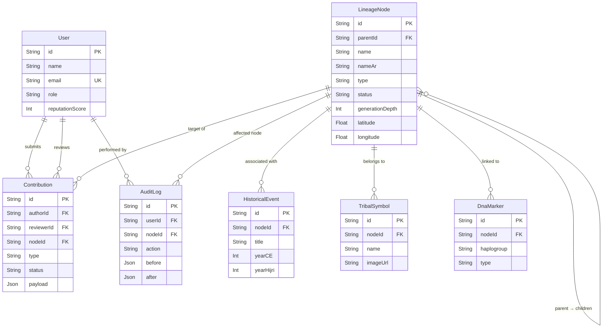

# 🗄️ Database Schema Design

**Project:** ArabTree
**Version:** 1.0
**Last Updated:** 2026-02-12

---

## Table of Contents

1. [Overview](#1-overview)
2. [Entity Relationship Diagram](#2-entity-relationship-diagram)
3. [Prisma Schema](#3-prisma-schema)
4. [Key Design Decisions](#4-key-design-decisions)
5. [Query Patterns](#5-query-patterns)
6. [Indexing Strategy](#6-indexing-strategy)
7. [Data Validation Rules](#7-data-validation-rules)
8. [Seed Data Structure](#8-seed-data-structure)
9. [Migration & Evolution Strategy](#9-migration--evolution-strategy)

---

## 1. Overview

ArabTree uses **MongoDB** as its primary database, accessed via **Prisma ORM**. The schema is designed around a central `LineageNode` model with a **self-referencing relation** to support infinite nesting of generations.

### Model Summary

| Model | Purpose | Record Count (Est.) |
|---|---|---|
| `User` | Authentication, profile, RBAC | 10K–100K |
| `LineageNode` | Core genealogical tree nodes | 100K–1M+ |
| `Contribution` | User-submitted data with verification | 50K–500K |
| `HistoricalEvent` | Timeline events tied to nodes | 10K–100K |
| `TribalSymbol` | Tribal brands/Wasm (وسم) images | 1K–10K |
| `DnaMarker` | Haplogroup data linked to branches | 5K–50K |
| `AuditLog` | Immutable write operation history | 100K+ |
| `Account` / `Session` | NextAuth.js OAuth + sessions | Matches User count |

---

## 2. Entity Relationship Diagram



---

## 3. Prisma Schema

```prisma
// prisma/schema.prisma

generator client {
  provider = "prisma-client-js"
}

datasource db {
  provider = "mongodb"
  url      = env("DATABASE_URL")
}

// ──────────────────────────────────────────────
// 🔐 User & Authentication
// ──────────────────────────────────────────────

model User {
  id              String    @id @default(auto()) @map("_id") @db.ObjectId
  name            String
  email           String    @unique
  emailVerified   DateTime?
  image           String?
  passwordHash    String?
  role            UserRole  @default(VIEWER)
  reputationScore Int       @default(0)    // Earned via approved contributions
  bio             String?                  // Optional user biography
  locale          String    @default("ar") // Preferred language: "ar" | "en"

  // Relations
  contributions  Contribution[] @relation("author")
  reviews        Contribution[] @relation("reviewer")
  auditLogs      AuditLog[]

  // NextAuth.js
  accounts Account[]
  sessions Session[]

  createdAt DateTime @default(now())
  updatedAt DateTime @updatedAt

  @@index([role])
  @@map("users")
}

model Account {
  id                String  @id @default(auto()) @map("_id") @db.ObjectId
  userId            String  @db.ObjectId
  type              String
  provider          String
  providerAccountId String
  refresh_token     String?
  access_token      String?
  expires_at        Int?
  token_type        String?
  scope             String?
  id_token          String?
  session_state     String?

  user User @relation(fields: [userId], references: [id], onDelete: Cascade)

  @@unique([provider, providerAccountId])
  @@map("accounts")
}

model Session {
  id           String   @id @default(auto()) @map("_id") @db.ObjectId
  sessionToken String   @unique
  userId       String   @db.ObjectId
  expires      DateTime

  user User @relation(fields: [userId], references: [id], onDelete: Cascade)

  @@map("sessions")
}

enum UserRole {
  VIEWER
  CONTRIBUTOR
  VERIFIER
  ADMIN
}

// ──────────────────────────────────────────────
// 🌳 Lineage Tree (Core Model)
// ──────────────────────────────────────────────

/// The central model of ArabTree. Each node represents a person, family,
/// clan, tribe, or root patriarch. Uses a self-referencing relation to
/// model the parent ↔ children hierarchy with infinite nesting depth.
model LineageNode {
  id              String        @id @default(auto()) @map("_id") @db.ObjectId

  // ── Identity ──
  name            String        // Transliterated Latin name (e.g., "Adnan")
  nameAr          String        // Arabic name (e.g., "عدنان")
  title           String?       // Honorary title (e.g., "أبو القبائل")
  epithet         String?       // Laqab / Nisba (e.g., "التميمي")
  alternateNames  String[]      // Alternate spellings & transliterations

  // ── Hierarchy ──
  type            NodeType
  generationDepth Int           @default(0) // Distance from root (0 = root patriarch)

  // ── Self-Referencing Relation (Parent ↔ Children) ──
  parentId        String?       @db.ObjectId
  parent          LineageNode?  @relation("ParentChild", fields: [parentId], references: [id], onDelete: NoAction, onUpdate: NoAction)
  children        LineageNode[] @relation("ParentChild")
  childCount      Int           @default(0) // Denormalized for display without loading children

  // ── Metadata ──
  status          NodeStatus    @default(DRAFT)
  biography       String?       // Rich text biography / notes
  biographyAr     String?       // Arabic biography
  birthYear       Int?          // Approximate birth year (CE)
  birthYearHijri  Int?          // Approximate birth year (Hijri)
  deathYear       Int?          // Approximate death year (CE)
  deathYearHijri  Int?          // Approximate death year (Hijri)
  birthPlace      String?       // Region or city
  era             String?       // Historical era label (e.g., "الجاهلية", "الأموي")

  // ── Geolocation (for map features) ──
  latitude        Float?
  longitude       Float?

  // ── Relations ──
  contributions    Contribution[]
  historicalEvents HistoricalEvent[]
  tribalSymbols    TribalSymbol[]
  dnaMarkers       DnaMarker[]

  // ── Authorship ──
  createdById     String?       @db.ObjectId // Who created this node

  createdAt       DateTime      @default(now())
  updatedAt       DateTime      @updatedAt

  @@index([parentId])
  @@index([name])
  @@index([nameAr])
  @@index([type, status])
  @@index([generationDepth])
  @@index([createdById])
  @@map("lineage_nodes")
}

enum NodeType {
  ROOT        // Adnan, Qahtan — root patriarchs
  TRIBE       // Major tribe (e.g., Banu Tamim)
  CLAN        // Sub-tribe / clan
  FAMILY      // Family unit
  INDIVIDUAL  // Single person
}

enum NodeStatus {
  DRAFT       // Created but not submitted
  PENDING     // Submitted for review
  PUBLISHED   // Verified and public
  FLAGGED     // Under community review
  ARCHIVED    // Removed from public view
}

// ──────────────────────────────────────────────
// ✅ Contribution & Verification
// ──────────────────────────────────────────────

/// Tracks user-submitted contributions to the lineage tree.
/// Each contribution targets a specific node and goes through
/// a verification workflow (Draft → Pending → Approved/Rejected).
model Contribution {
  id            String             @id @default(auto()) @map("_id") @db.ObjectId

  // ── Who ──
  authorId      String             @db.ObjectId
  author        User               @relation("author", fields: [authorId], references: [id])
  reviewerId    String?            @db.ObjectId
  reviewer      User?              @relation("reviewer", fields: [reviewerId], references: [id])

  // ── What ──
  nodeId        String             @db.ObjectId
  node          LineageNode        @relation(fields: [nodeId], references: [id])
  type          ContributionType
  payload       Json               // The proposed changes (flexible structure)
  summary       String?            // Human-readable summary of the proposed change

  // ── Workflow ──
  status        ContributionStatus @default(DRAFT)
  reviewNote    String?            // Feedback from verifier
  rejectionCount Int               @default(0) // Track revision cycles
  submittedAt   DateTime?
  reviewedAt    DateTime?

  // ── Source / Evidence ──
  sources       Source[]           // Embedded array of source citations

  createdAt     DateTime           @default(now())
  updatedAt     DateTime           @updatedAt

  @@index([authorId])
  @@index([nodeId])
  @@index([status])
  @@index([status, submittedAt])
  @@map("contributions")
}

/// Embedded type for source citations attached to contributions.
type Source {
  sourceType    String   // "book", "manuscript", "oral_history", "dna_report", "academic_paper", "genealogy_register"
  title         String   // Source title
  author        String?  // Source author (if applicable)
  year          Int?     // Publication year
  url           String?  // URL or DOI
  isbn          String?  // ISBN (for books)
  note          String?  // Additional context
}

enum ContributionType {
  ADD_NODE      // Propose a new lineage node
  EDIT_NODE     // Propose changes to an existing node
  MERGE_NODES   // Propose merging duplicate nodes
  ADD_SOURCE    // Attach a new source to a node
  ADD_EVENT     // Add a historical event
}

enum ContributionStatus {
  DRAFT
  PENDING
  APPROVED
  REJECTED
  WITHDRAWN
}

// ──────────────────────────────────────────────
// 📜 Historical Events
// ──────────────────────────────────────────────

/// Historical events associated with a lineage node (tribe, clan, or individual).
/// Used to enrich the tree with context and power the historical maps feature.
model HistoricalEvent {
  id          String      @id @default(auto()) @map("_id") @db.ObjectId

  nodeId      String      @db.ObjectId
  node        LineageNode @relation(fields: [nodeId], references: [id])

  title       String      // Event title (English)
  titleAr     String?     // Arabic title
  description String?     // Detailed description
  descriptionAr String?   // Arabic description
  date        DateTime?   // Approximate date (if known precisely)
  yearHijri   Int?        // Hijri calendar year
  yearCE      Int?        // Common Era year
  eventType   EventType   // Typed for filtering

  // ── Location ──
  location    String?     // Place name
  latitude    Float?
  longitude   Float?

  createdAt   DateTime    @default(now())
  updatedAt   DateTime    @updatedAt

  @@index([nodeId])
  @@index([eventType])
  @@index([yearCE])
  @@map("historical_events")
}

enum EventType {
  MIGRATION     // Tribal migration
  BATTLE        // Military engagement
  FOUNDING      // Establishment of a settlement or tribe
  ALLIANCE      // Tribal alliance or pact
  GENEALOGICAL  // Birth, death, marriage of notable figure
  CULTURAL      // Cultural milestone
  OTHER
}

// ──────────────────────────────────────────────
// 🏷️ Tribal Symbols (Wasm / Brands)
// ──────────────────────────────────────────────

/// Tribal symbols, brands (Wasm/وسم), and emblems associated with
/// tribes and clans. These are the traditional marks used to identify
/// livestock, territory, and tribal identity.
model TribalSymbol {
  id          String      @id @default(auto()) @map("_id") @db.ObjectId

  nodeId      String      @db.ObjectId
  node        LineageNode @relation(fields: [nodeId], references: [id])

  name        String      // Symbol name
  nameAr      String?     // Arabic name (الاسم بالعربية)
  description String?     // Description and historical context
  imageUrl    String      // URL to the symbol image (Vercel Blob)
  svgPath     String?     // Raw SVG path data (for inline rendering)
  symbolType  SymbolType  // Typed for filtering

  createdAt   DateTime    @default(now())
  updatedAt   DateTime    @updatedAt

  @@index([nodeId])
  @@index([symbolType])
  @@map("tribal_symbols")
}

enum SymbolType {
  WASM        // وسم — livestock brand
  FLAG        // Tribal flag
  EMBLEM      // Coat of arms / emblem
  SEAL        // Official seal
}

// ──────────────────────────────────────────────
// 🧬 DNA Markers
// ──────────────────────────────────────────────

/// DNA haplogroup markers linked to lineage branches for
/// scientific validation of genealogical connections.
model DnaMarker {
  id          String      @id @default(auto()) @map("_id") @db.ObjectId

  nodeId      String      @db.ObjectId
  node        LineageNode @relation(fields: [nodeId], references: [id])

  haplogroup  String      // e.g., "J1-M267", "E1b1b"
  type        DnaType     // Y-DNA, mtDNA, or Autosomal
  subClade    String?     // Downstream subclade (e.g., "J1-FGC12")
  confidence  Float?      // Confidence level (0.0 - 1.0)
  sampleSize  Int?        // Number of tested individuals
  source      String?     // Testing company or study reference
  studyUrl    String?     // Link to original study or report
  notes       String?

  createdAt   DateTime    @default(now())
  updatedAt   DateTime    @updatedAt

  @@index([nodeId])
  @@index([haplogroup])
  @@index([type])
  @@map("dna_markers")
}

enum DnaType {
  Y_DNA       // Paternal lineage
  MT_DNA      // Maternal lineage
  AUTOSOMAL   // Ethnicity estimate
}

// ──────────────────────────────────────────────
// 📋 Audit Log (Immutable)
// ──────────────────────────────────────────────

/// Immutable audit trail for all write operations on lineage data.
/// Used for accountability, dispute resolution, and rollback support.
model AuditLog {
  id          String    @id @default(auto()) @map("_id") @db.ObjectId

  userId      String    @db.ObjectId
  user        User      @relation(fields: [userId], references: [id])

  action      AuditAction
  entityType  String    // "LineageNode", "Contribution", "DnaMarker", etc.
  entityId    String    @db.ObjectId
  before      Json?     // Snapshot before change (null for creates)
  after       Json?     // Snapshot after change (null for deletes)
  metadata    Json?     // Additional context (IP, user-agent, etc.)

  createdAt   DateTime  @default(now())

  @@index([userId])
  @@index([entityType, entityId])
  @@index([createdAt])
  @@map("audit_logs")
}

enum AuditAction {
  CREATE
  UPDATE
  DELETE
  RESTORE
  APPROVE
  REJECT
  FLAG
}
```

---

## 4. Key Design Decisions

### 4.1 Self-Referencing Relation

The `LineageNode` model uses a **self-referencing relation** (`parent` / `children`) to model the genealogical tree:

```prisma
parentId  String?       @db.ObjectId
parent    LineageNode?  @relation("ParentChild", fields: [parentId], references: [id])
children  LineageNode[] @relation("ParentChild")
```

- **`parentId`** is nullable — root patriarchs (Adnan, Qahtan) have no parent.
- **`children`** is an array — each node can have unlimited children.
- This design supports **infinite nesting depth** without schema changes.
- The `generationDepth` field is denormalized for efficient depth-based queries.
- The `childCount` field is denormalized to display child counts without loading children.

### 4.2 Embedded vs. Referenced Documents

| Data | Strategy | Rationale |
|---|---|---|
| `Source` (on Contribution) | **Embedded** (Prisma `type`) | Always read with the contribution; no independent queries needed |
| `HistoricalEvent` | **Referenced** (separate model) | Queried independently for maps; can be shared across nodes in future |
| `DnaMarker` | **Referenced** (separate model) | Queried independently for haplogroup search/aggregation |
| `TribalSymbol` | **Referenced** (separate model) | Requires image storage; queried independently for galleries |

### 4.3 MongoDB-Specific Considerations

| Decision | Rationale |
|---|---|
| **ObjectId for primary keys** | Native MongoDB IDs for optimal performance |
| **Denormalized `generationDepth`** | Avoids recursive computation for depth-based queries |
| **Denormalized `childCount`** | Avoids `COUNT(*)` queries when displaying tree nodes |
| **`alternateNames` array** | Supports multiple transliterations for fuzzy search matching |
| **Text indexes on `name` and `nameAr`** | Enables MongoDB full-text search with Arabic support |
| **`Json` type for contribution payload** | Flexible schema for different contribution types |
| **Separate models (not embedded docs)** | Prisma MongoDB adapter works best with top-level models |
| **Immutable `AuditLog`** | No `updatedAt` — audit entries are never modified, only appended |

---

## 5. Query Patterns

### 5.1 Fetch Ancestor Path (Node → Root)

```typescript
async function getAncestorPath(nodeId: string): Promise<LineageNode[]> {
  const path: LineageNode[] = [];
  let currentId: string | null = nodeId;

  // Iteratively walk up the tree (avoids deep recursion)
  while (currentId) {
    const node = await prisma.lineageNode.findUnique({
      where: { id: currentId },
      select: {
        id: true,
        name: true,
        nameAr: true,
        type: true,
        parentId: true,
        generationDepth: true,
      },
    });

    if (!node) break;
    path.unshift(node);
    currentId = node.parentId;
  }

  return path;
}
```

**Performance Note:** Maximum depth is ~50 generations (Adnan → modern individual). Each iteration is an indexed `findUnique` by `_id`, so total time is <100ms even at max depth.

### 5.2 Fetch Subtree (Node + N Levels of Descendants)

```typescript
async function getSubtree(nodeId: string, depth: number = 3) {
  const buildInclude = (d: number): any =>
    d === 0
      ? { children: { select: { id: true, name: true, nameAr: true, type: true, childCount: true } } }
      : { children: { include: buildInclude(d - 1) } };

  return prisma.lineageNode.findUnique({
    where: { id: nodeId },
    include: buildInclude(depth),
  });
}
```

### 5.3 Fuzzy Search (Arabic + Latin)

```typescript
async function fuzzySearch(query: string, filters?: SearchFilters) {
  const isArabic = /[\u0600-\u06FF]/.test(query);

  return prisma.lineageNode.findMany({
    where: {
      AND: [
        {
          OR: [
            { name: { contains: query, mode: 'insensitive' } },
            { nameAr: { contains: query, mode: 'insensitive' } },
            { alternateNames: { has: query } },
          ],
        },
        filters?.type ? { type: filters.type } : {},
        filters?.status ? { status: filters.status } : { status: 'PUBLISHED' },
      ],
    },
    select: {
      id: true,
      name: true,
      nameAr: true,
      type: true,
      generationDepth: true,
      parentId: true, // For building lineage path preview
    },
    take: filters?.limit ?? 20,
    orderBy: { generationDepth: 'asc' }, // Show higher-level nodes first
  });
}
```

### 5.4 Contribution Feed (Verifier Dashboard)

```typescript
async function getPendingContributions(page: number = 1, pageSize: number = 20) {
  const [contributions, totalCount] = await Promise.all([
    prisma.contribution.findMany({
      where: { status: 'PENDING' },
      include: {
        author: { select: { id: true, name: true, reputationScore: true } },
        node: { select: { id: true, name: true, nameAr: true, type: true } },
      },
      orderBy: { submittedAt: 'asc' }, // FIFO — oldest first
      skip: (page - 1) * pageSize,
      take: pageSize,
    }),
    prisma.contribution.count({ where: { status: 'PENDING' } }),
  ]);

  return { contributions, totalCount, page, pageSize };
}
```

---

## 6. Indexing Strategy

### 6.1 MongoDB Indexes

| Collection | Index | Type | Purpose |
|---|---|---|---|
| `lineage_nodes` | `{ _id: 1 }` | Primary | Default PK lookup |
| `lineage_nodes` | `{ parentId: 1 }` | Single | Children lookup for tree traversal |
| `lineage_nodes` | `{ name: 1 }` | Single | Name search |
| `lineage_nodes` | `{ nameAr: 1 }` | Single | Arabic name search |
| `lineage_nodes` | `{ type: 1, status: 1 }` | Compound | Filtered node listing |
| `lineage_nodes` | `{ generationDepth: 1 }` | Single | Depth-based queries |
| `lineage_nodes` | `{ name: "text", nameAr: "text" }` | Text | Full-text search |
| `contributions` | `{ status: 1, submittedAt: 1 }` | Compound | Verifier dashboard (FIFO) |
| `contributions` | `{ authorId: 1 }` | Single | User's contribution history |
| `contributions` | `{ nodeId: 1 }` | Single | Node's contribution history |
| `historical_events` | `{ nodeId: 1 }` | Single | Events for a node |
| `historical_events` | `{ yearCE: 1 }` | Single | Timeline queries |
| `dna_markers` | `{ haplogroup: 1 }` | Single | Haplogroup search |
| `audit_logs` | `{ entityType: 1, entityId: 1 }` | Compound | Audit trail for entity |
| `audit_logs` | `{ createdAt: 1 }` | Single | Time-based audit queries |

### 6.2 Index Size Estimate

At 100K lineage nodes:
- Primary index: ~3MB
- `parentId` index: ~2MB
- Text index (`name`, `nameAr`): ~10MB
- **Total index footprint: ~25MB** (easily fits in RAM)

---

## 7. Data Validation Rules

These rules are enforced at the **service layer** via Zod schemas (not at the database level):

| Field | Rule | Enforcement |
|---|---|---|
| `name` | 2–100 characters, Latin + spaces + hyphens | Zod regex |
| `nameAr` | 2–100 characters, Arabic script + spaces | Zod regex |
| `type` | Must be valid `NodeType` enum | Zod enum |
| `type` (hierarchy) | Child type must be ≥ parent type (ROOT > TRIBE > CLAN > FAMILY > INDIVIDUAL) | Service logic |
| `generationDepth` | Auto-computed: `parent.generationDepth + 1` | Service logic |
| `childCount` | Auto-incremented on child creation, decremented on deletion | Service logic |
| `birthYear` / `deathYear` | `deathYear >= birthYear` if both present | Zod `.refine()` |
| `latitude` | -90 to 90 | Zod range |
| `longitude` | -180 to 180 | Zod range |
| `DnaMarker.confidence` | 0.0 to 1.0 | Zod range |
| `Contribution` for TRIBE/ROOT | Must have at least one `Source` entry | Service logic |
| `email` | Valid email format, unique | Zod + Prisma unique |

---

## 8. Seed Data Structure

To bootstrap the tree, seed data follows this hierarchy:

```
Adnan / عدنان (ROOT, depth: 0)
├── Ma'ad / معد (TRIBE, depth: 1)
│   ├── Nizar / نزار (TRIBE, depth: 2)
│   │   ├── Mudar / مضر (TRIBE, depth: 3)
│   │   │   ├── Qays Aylan / قيس عيلان (TRIBE, depth: 4)
│   │   │   │   ├── Hawazin / هوازن (CLAN, depth: 5)
│   │   │   │   └── Ghatafan / غطفان (CLAN, depth: 5)
│   │   │   └── Khindif / خندف (TRIBE, depth: 4)
│   │   │       ├── Tamim / تميم (CLAN, depth: 5)
│   │   │       └── Hudhail / هذيل (CLAN, depth: 5)
│   │   └── Rabi'a / ربيعة (TRIBE, depth: 3)
│   │       ├── Bakr / بكر (CLAN, depth: 4)
│   │       └── Taghlib / تغلب (CLAN, depth: 4)
│   └── ...
└── ...

Qahtan / قحطان (ROOT, depth: 0)
├── Ya'rub / يعرب (TRIBE, depth: 1)
│   ├── Yashjub / يشجب (TRIBE, depth: 2)
│   │   ├── Saba / سبأ (TRIBE, depth: 3)
│   │   │   ├── Himyar / حِمْيَر (TRIBE, depth: 4)
│   │   │   └── Kahlan / كهلان (TRIBE, depth: 4)
│   │   │       ├── Azd / الأزد (CLAN, depth: 5)
│   │   │       ├── Tayy / طيء (CLAN, depth: 5)
│   │   │       └── Hamdan / همدان (CLAN, depth: 5)
│   │   └── ...
│   └── ...
└── ...
```

The seed script (`prisma/seed.ts`) will:
1. Clear existing data in development (safety check: never in production)
2. Create root patriarchs with `status: PUBLISHED`
3. Recursively create 5 levels of tribal hierarchy (~100 nodes)
4. Set all seed nodes as `PUBLISHED` (pre-verified)
5. Create a default ADMIN user for development

---

## 9. Migration & Evolution Strategy

### 9.1 Schema Changes

Since MongoDB is schemaless and Prisma uses `prisma db push` (not SQL migrations):

| Scenario | Approach |
|---|---|
| **Add new optional field** | Add to schema, `prisma db push` — no data migration needed |
| **Add new required field** | Add with `@default()` value, `prisma db push`, then backfill |
| **Rename field** | Add new field, write migration script to copy data, remove old field |
| **Add new model** | Add to schema, `prisma db push` — creates new collection |
| **Remove field** | Remove from schema, `prisma db push` — old data remains in documents (no-op) |

### 9.2 Data Migration Scripts

For non-trivial migrations, create scripts in `prisma/migrations/`:

```
prisma/
├── schema.prisma
├── seed.ts
└── migrations/
    ├── 001_backfill_generation_depth.ts
    ├── 002_add_alternate_names.ts
    └── README.md
```

### 9.3 Backup Strategy

| Environment | Frequency | Retention | Method |
|---|---|---|---|
| **Production** | Continuous (oplog) | 7 days point-in-time | MongoDB Atlas automated |
| **Production** | Daily snapshot | 30 days | MongoDB Atlas scheduled |
| **Pre-migration** | Before each migration | Until verified | Manual `mongodump` |
